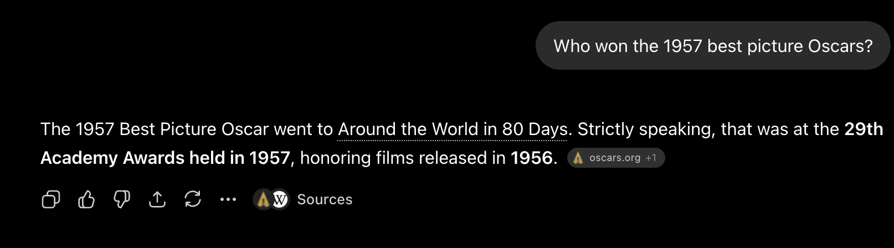

# Oscars AI

**THIS FILE IS A DRAFT**

> Lights, Camera, and... Action

For a short period of time we are transported to a world created by the imagination of screenwriters, envisioned by
directors, acted by actresses and actors. Whether that period is five minutes or two and a half hours, we are not sit on
a movie theater, we are elsewhere, since escaping from a horde of monsters on a land of fantasy imagination land, or
even in a real city of the world in some historic moment. Pure magic.

But to transport us to another place, movies have a big team, with people taking care of the scenario, wardrobe, music,
sound effects, special effects, among others. There is a huge team of professionals doing their work in order
totransport us where we must be. When one thing is not done well, we feel uncomfortable and we remember that we are sit
on a movie theater. They must do their work well. They must be the best.

And to be recognized, there are movie festivals, where a small sample of the movies are selected during a certain period
of time (commonly one year). There is a lot of festivals nowadays and one of them
is [The Oscars](https://www.oscars.org/). It started small, in 1929, occurring at lunchtime, with 270 people, in a hotel
and delivered 15 statues for movies starred in 1927 and 1928. It evolved to become one of the most important ceremonies
of the world.

Many happened in the movie industry (and to The Oscars) from the first edition to 2025 (my dataset is from 1929 to
2025): the advent of sound in movies, the advent of colors in movies, war and other conflicts inspired people, people
and culture influenced moviemakers, books and other media (like comics) were important source of inspiration, a lot
happened since the first edition.

This article intention is to use RAG (Retrieval-Augmented Generation) with AI in Spring Boot AI project to create an
interface in natural language asking questions for The Oscars dataset. The Oscars has a huge amount of data that can be
discovered using those questions and not with an mechanic API offering some selected methods.

---

## The code

The [code for this article](https://github.com/ortolanph/oscars-ai-rag) is located at my Github.

## RAG - Retrieval-augmented Generation

LLMs knows about The Oscars? But what do they know? Everything? If you ask a question to ChatGPT for who won the Oscars
in 1957, what it will answer? I've tried this and the answer was right:

But, notice one thing: it had to search the web to find the answer. It probably consumed some extra tokens and in this
AI time, tokens are money. Imagine a system in which you have lots of clients and they are asking many different
questions, and the system must search the web to compose an answer. It's a money spreading system. You or your company
will run out of tokens fast.

What if the data of all The Oscars history is available for a system to answer these kinds of questions (or
more)? https://en.wikipedia.org/wiki/Retrieval-augmented_generation is a technique on which is possible to use data of
any kind (structured or unstructured) to train your AI model to answer questions. Structured means files like CSV, JSON,
XML, and unstructured means files like PDF documents, images, audios, videos, web pages (like the AI used to respond the
question above), and others that does not contains a certain repeatable format.

Other problem that RAG solves is that data can reside in a private environment. The training data is stored in a Vector
Database controlled by a company, not publicly available. Datasets with sensitive data can use RAG to train their local
AI models to answer external customers questions without exposing too much information.

Basically

## The Data

The data used on this article was extracted
from [Kaggle The Oscar Award, 1927 - 2026 dataset](https://www.kaggle.com/datasets/unanimad/the-oscar-award) that is an
online community for data science and machine learning. It's a Google subsidiary which serves as a central hub where
practitioners and enthusiasts can collaborate, share resources, and test their skills.

There are 11240 lines of data with all the Oscars information. This data is structured as a CSV file, so it'll be easy
to ingest with the right framework. It could be a document file (PDF) with styles to separate ceremonies, and the
categories.

## How it works

First things first.

## Monitoring

## Some thoughts

Something is missing here. There are some questions that could not be answered like:

One thing that I could do is to break the ingestion of data by ceremony (ceremony field) and not by a number to divide
the data. This way I could extract some extra information like:

* The most nominated movie of the season
* The most winner movie of the season
* [The Big Five](https://en.wikipedia.org/wiki/List_of_Big_Five_Academy_Award_winners_and_nominees) movies (
  a movie that won the best movie, best director, best actor, best actress, and best screenplay adapted or original)
* Ranking of countries that won an Oscar in the International Feature Film category and their movies
* Many others...

This way, the similarity search could work better and add more layers to the example data for the AI take conclusions
for a better response.

## Conclusions

RAG is a powerful AI framework, but the data source and how it is loaded will interfere with the data processing. The
better the data is stored in the Vector Database, better the responses will get. Of course that, a specialized AI model
will return a more refined answer.