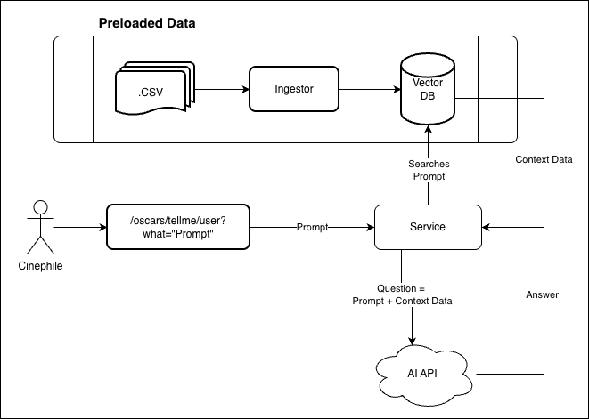
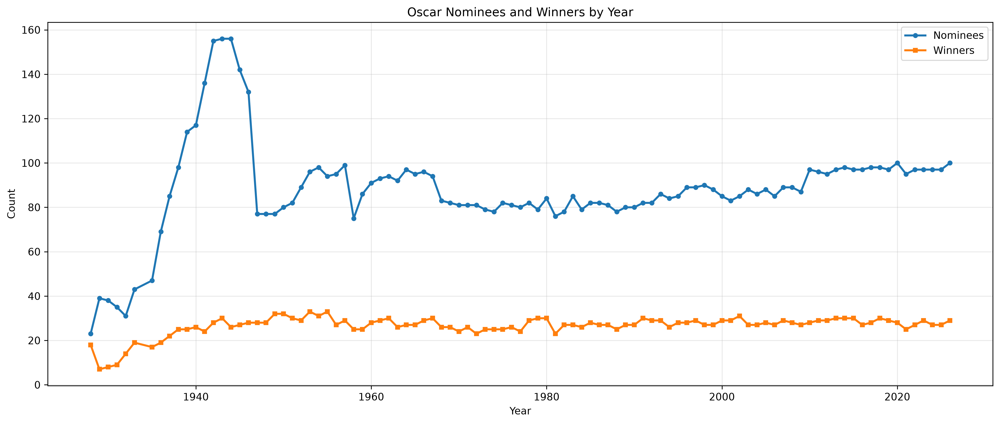
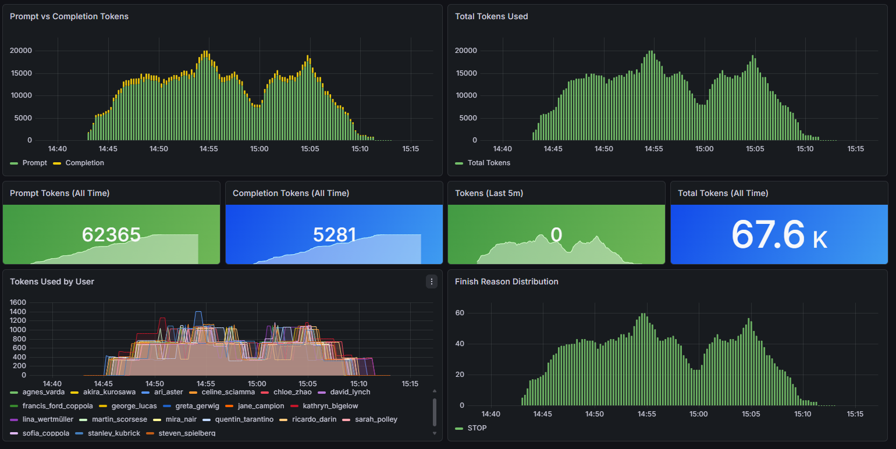

# Oscars AI

**THIS FILE IS A DRAFT**

> Lights, Camera, and... Action

For a short period of time we are transported to a world created by the imagination of screenwriters, envisioned by
directors, acted by actresses and actors. Whether that period is five minutes or two and a half hours, we are not sit on
a movie theater, we are elsewhere, since escaping from a horde of monsters on a land of fantasy imagination land, or
even in a real city of the world in some historic moment. Pure magic.

But to transport us to another place, movies have a big team, with people taking care of the scenario, wardrobe, music,
sound effects, special effects, among others. There is a huge team of professionals doing their work in order
totransport us where we must be. When one thing is not done well, we feel uncomfortable and we remember that we are sit
on a movie theater. They must do their work well. They must be the best.

And to be recognized, there are movie festivals, where a small sample of the movies are selected during a certain period
of time (commonly one year). There is a lot of festivals nowadays and one of them
is [The Oscars](https://www.oscars.org/). It started small, in 1929, occurring at lunchtime, with 270 people, in a hotel
and delivered 15 statues for movies starred in 1927 and 1928. It evolved to become one of the most important ceremonies
of the world.

Many happened in the movie industry (and to The Oscars) from the first edition to 2025 (my dataset is from 1929 to
2025): the advent of sound in movies, the advent of colors in movies, war and other conflicts inspired people, people
and culture influenced moviemakers, books and other media (like comics) were important source of inspiration, a lot
happened since the first edition.

This article intention is to use RAG (Retrieval-Augmented Generation) with AI in Spring Boot AI project to create an
interface in natural language asking questions for The Oscars dataset. The Oscars has a huge amount of data that can be
discovered using those questions and not with an mechanic API offering some selected methods.

---

## The code

The [code for this article](https://github.com/ortolanph/oscars-ai-rag) is located at my Github.

## RAG - Retrieval-augmented Generation

Do LLMs knows about The Oscars? But what do they know? Everything? If you ask a question to ChatGPT for who won the Oscars
in 1957, what it will answer? I've tried this and the answer was right:


But, notice one thing: it had to search the web to find the answer. It probably consumed some extra tokens and in this
AI time, tokens are money. Imagine a system in which you have lots of clients and they are asking many different
questions, and the system must search the web to compose an answer. It's a money spreading system. You or your company
will run out of tokens fast.

What if the data of all The Oscars history is available for a system to answer these kinds of questions (or
more)? https://en.wikipedia.org/wiki/Retrieval-augmented_generation is a technique on which is possible to use data of
any kind (structured or unstructured) to train your AI model to answer questions. Structured means files like CSV, JSON,
XML, and unstructured means files like PDF documents, images, audios, videos, web pages (like the AI used to respond the
question above), and others that does not contains a certain repeatable format.

Other problem that RAG solves is that data can reside in a private environment. The training data is stored in a Vector
Database controlled by the company, not publicly available. Datasets with sensitive data can use RAG to train their
local AI models to answer external customers questions without exposing information with consent.

Basically it takes the user input (the question), performs a similarity search on the preloaded database, joins the
user's question with the result of the similarity search results, sends to the LLM, waits for the response, and
finally returns the response to the user. Seems a lot of things to do, but it's not. Preloading the data is the key for
fast answers. The data source can be alive being fed everytime new information is available at the source. The diagram
illustrates this process:



## The Data

The data used on this article was extracted
from [Kaggle The Oscar Award, 1927 - 2026 dataset](https://www.kaggle.com/datasets/unanimad/the-oscar-award) that is an
online community for data science and machine learning. It's a Google subsidiary which serves as a central hub where
practitioners and enthusiasts can collaborate, share resources, and test their skills.

There are 11240 lines of data with all the Oscars information. This data is structured as a CSV file, so it'll be easy
to ingest with the right framework. It could be a document file (PDF) with styles to separate ceremonies, and the
categories.

The graphic below shows the relation between The Oscars nominees and winners along the time. One thing that can be seen
is that the winners represent 20% of the winners.



## How it works

Now that everything is known, it's coding time! Yeah!

First thing is to implement the ingestor which will transform the datasource into data on the Vector database. The
selected database was [Redis](https://redis.io/) which is a Document NOSQL database perfect for VectorStore. The
data ingestor was created for that just for didactic purposes. In a real world system, this database should be fed by
other processes internal or external to the main project.

To ingest all the lines, I divided the loading into batches of 500 lines. I checked that there is an average of 115
lines per ceremony. It could be divided with this, but the loading time should be slower. The main thing is converting
the data into an unit on which the AI API will understand. This unit is a Document, with some metadata to tag the data,
to make it eligible in the similarity search. The code below shows a code excerpt for the ingestion:

```java
    String text = OSCAR_PHRASE.formatted(
        name,
        yearCeremony, ordinal(ceremony), yearFilm,
        canonCategory.isBlank() ? category : canonCategory,
        film,
        isWinner ? "They WON the award." : "They did not win.");

    return new

Document(text, Map.of(
                 "year_film", yearFilm,
            "year_ceremony",yearCeremony,
            "ceremony",ceremony,
            "category",category,
            "canon_category",canonCategory,
            "name",name,
            "film",film,
            "winner",winner
         ));
```

The JSON below is what is saved on the database. I decided to abbreviate the embedding field, that is the numerical
representation of the data that allows the AI understand the data.
Check [this link](https://ortolanph.neocities.org/javalotsofbeans/juliette_binoche_2000_oscars_actress_in_a_leading_role.json)
for the full content. By the way, Julia Roberts won the Oscar
for [Actress in a Leading Role in 2001](https://www.oscars.org/oscars/ceremonies/2001) for Erin Brockovich.

```json lines
{
  "canon_category": "ACTRESS IN A LEADING ROLE",
  "winner": "False",
  "ceremony": "73",
  "year_film": "2000",
  "name": "Juliette Binoche",
  "embedding": [
    (...)
  ],
  "film": "Chocolat",
  "category": "ACTRESS IN A LEADING ROLE",
  "content": "Juliette Binoche was nominated at the 2001 Academy Awards (ceremony #73rd, year 2000) in the category \"ACTRESS IN A LEADING ROLE\" for the film \"Chocolat\". They did not win.",
  "year_ceremony": "2001"
}
```

Loading the data is like reaching the first plot, overcoming the first challenge. Now the movie really begins. With all
the required services up and running we need a service to communicate with the database and the chat client. Let's see
the code below:

```java
        List<Document> docs = vectorStore.similaritySearch(
        SearchRequest.builder()
                .query(prompt)
                .topK(TOP_K)
                .build()
);

String context = docs.stream()
        .map(Document::getText)
        .collect(Collectors.joining("\n- ", "- ", ""));
```

This code searches for the given prompt on the vector store (our database) for top `k` results (which can be configured)
and is converted to a simple String to be processed. The code below shows the next step:

```java
        String augmentedPrompt = """
        You are an expert on the Academy Awards (Oscars).
        Answer the user's question using ONLY the context below.
        If the context does not contain enough information, say so honestly.
        
        Context:
        %s
        
        Question: %s
        """.formatted(context, prompt);

ChatResponse response = chatClient.prompt()
        .user(augmentedPrompt)
        .call()
        .chatResponse();
```

Here the program create an augmented prompt with the context retrieved by the similarity search and the user's prompt in
a form of question. We can ask the AI if Juliette Binoche won an Oscar on 2000 and we will have the following.

```http request
GET http://localhost:10002/oscars/tellme/username?what=%22Juliette%20Binoche%20won%20an%20Oscar%20on%202000?%22
```

The prompt will change to:

```text
You are an expert on the Academy Awards (Oscars).
Answer the user's question using ONLY the context below.
If the context does not contain enough information, say so honestly.

Context:
- David Brown/Kit Golden/Leslie Holleran was nominated at the 2001 Academy Awards (ceremony #73rd, year 2000) in the category "BEST PICTURE" for the film "Chocolat". They did not win.
- Angelina Jolie was nominated at the 2009 Academy Awards (ceremony #81st, year 2008) in the category "ACTRESS IN A LEADING ROLE" for the film "Changeling". They did not win.
- Juliette Binoche was nominated at the 1997 Academy Awards (ceremony #69th, year 1996) in the category "ACTRESS IN A SUPPORTING ROLE" for the film "The English Patient". They WON the award.
- Marion Cotillard was nominated at the 2015 Academy Awards (ceremony #87th, year 2014) in the category "ACTRESS IN A LEADING ROLE" for the film "Two Days, One Night". They did not win.
- Annette Bening was nominated at the 2000 Academy Awards (ceremony #72nd, year 1999) in the category "ACTRESS IN A LEADING ROLE" for the film "American Beauty". They did not win.
- Simone Signoret was nominated at the 1960 Academy Awards (ceremony #32nd, year 1959) in the category "ACTRESS IN A LEADING ROLE" for the film "Room at the Top". They WON the award.
- Julia Roberts was nominated at the 2001 Academy Awards (ceremony #73rd, year 2000) in the category "ACTRESS IN A LEADING ROLE" for the film "Erin Brockovich". They WON the award.
- Joan Allen was nominated at the 2001 Academy Awards (ceremony #73rd, year 2000) in the category "ACTRESS IN A LEADING ROLE" for the film "The Contender". They did not win.
- Julie Walters was nominated at the 2001 Academy Awards (ceremony #73rd, year 2000) in the category "ACTRESS IN A SUPPORTING ROLE" for the film "Billy Elliot". They did not win.
- Juliet Taylor was nominated at the 2025 Academy Awards (ceremony #97th, year 2024) in the category "HONORARY AWARD" for the film "". They WON the award.
- Isabelle Adjani was nominated at the 1990 Academy Awards (ceremony #62nd, year 1989) in the category "ACTRESS IN A LEADING ROLE" for the film "Camille Claudel". They did not win.
- Nicole Kidman was nominated at the 2002 Academy Awards (ceremony #74th, year 2001) in the category "ACTRESS IN A LEADING ROLE" for the film "Moulin Rouge". They did not win.
- Angelina Jolie was nominated at the 2000 Academy Awards (ceremony #72nd, year 1999) in the category "ACTRESS IN A SUPPORTING ROLE" for the film "Girl, Interrupted". They WON the award.
- Leslie Caron was nominated at the 1954 Academy Awards (ceremony #26th, year 1953) in the category "ACTRESS IN A LEADING ROLE" for the film "Lili". They did not win.
- Ellen Burstyn was nominated at the 2001 Academy Awards (ceremony #73rd, year 2000) in the category "ACTRESS IN A LEADING ROLE" for the film "Requiem for a Dream". They did not win.
- Judi Dench was nominated at the 2001 Academy Awards (ceremony #73rd, year 2000) in the category "ACTRESS IN A SUPPORTING ROLE" for the film "Chocolat". They did not win.
- Simone Signoret was nominated at the 1966 Academy Awards (ceremony #38th, year 1965) in the category "ACTRESS IN A LEADING ROLE" for the film "Ship of Fools". They did not win.
- Genevieve Bujold was nominated at the 1970 Academy Awards (ceremony #42nd, year 1969) in the category "ACTRESS IN A LEADING ROLE" for the film "Anne of the Thousand Days". They did not win.
- Annette Bening was nominated at the 2005 Academy Awards (ceremony #77th, year 2004) in the category "ACTRESS IN A LEADING ROLE" for the film "Being Julia". They did not win.
- Julianne Moore was nominated at the 2000 Academy Awards (ceremony #72nd, year 1999) in the category "ACTRESS IN A LEADING ROLE" for the film "The End of the Affair". They did not win.
- Cate Blanchett was nominated at the 2007 Academy Awards (ceremony #79th, year 2006) in the category "ACTRESS IN A SUPPORTING ROLE" for the film "Notes on a Scandal". They did not win.
- Cate Blanchett was nominated at the 2005 Academy Awards (ceremony #77th, year 2004) in the category "ACTRESS IN A SUPPORTING ROLE" for the film "The Aviator". They WON the award.
- Chloë Sevigny was nominated at the 2000 Academy Awards (ceremony #72nd, year 1999) in the category "ACTRESS IN A SUPPORTING ROLE" for the film "Boys Don't Cry". They did not win.
- Cate Blanchett was nominated at the 2008 Academy Awards (ceremony #80th, year 2007) in the category "ACTRESS IN A SUPPORTING ROLE" for the film "I'm Not There". They did not win.
- Meryl Streep was nominated at the 2010 Academy Awards (ceremony #82nd, year 2009) in the category "ACTRESS IN A LEADING ROLE" for the film "Julie & Julia". They did not win.
- Marion Cotillard was nominated at the 2008 Academy Awards (ceremony #80th, year 2007) in the category "ACTRESS IN A LEADING ROLE" for the film "La Vie en Rose". They WON the award.
- Juliette Binoche was nominated at the 2001 Academy Awards (ceremony #73rd, year 2000) in the category "ACTRESS IN A LEADING ROLE" for the film "Chocolat". They did not win.
- Julianne Moore was nominated at the 1998 Academy Awards (ceremony #70th, year 1997) in the category "ACTRESS IN A SUPPORTING ROLE" for the film "Boogie Nights". They did not win.
- Catherine Deneuve was nominated at the 1993 Academy Awards (ceremony #65th, year 1992) in the category "ACTRESS IN A LEADING ROLE" for the film "Indochine". They did not win.
- Julianne Moore was nominated at the 2003 Academy Awards (ceremony #75th, year 2002) in the category "ACTRESS IN A SUPPORTING ROLE" for the film "The Hours". They did not win.

Question: "Juliette Binoche won an Oscar on 2001?"
```

The result of the API call is:

```text
No, Juliette Binoche did not win an Oscar in 2001. She was nominated in the category "ACTRESS IN A LEADING ROLE" for the film "Chocolat" but did not win.
```

As you can see in the augmented prompt, there are 30 of phrases. This is the result of similarity search of what was
stored in the database. The more phrases I have, the more tokens is spend. Maybe reducing this to 10 or 15 will make the
search work with more economy and bring the same result. The phrase above being at the end of the similarity search does
not means that it'll not be selected, the total results (topK) will select by quality and not by quantity. On
professional projects, where tokens can be spent to accurately solve the prompts, it could be greater.

## Testing and Monitoring

In the HTTP request above, you can see one part that is the `username`. I reserved this for monitoring who was doing
requests to the system. I could limit users limiting them to a certain quantity of tokens and blocking all the way
through, but my intention was only to monitor users activities and publish this into a [Grafana](https://grafana.com/)
dashboard.

When I have the Open API answer, I'm collecting the ChatResponse object and calling a metric service to retrieve all the
necessary telemetry information. From the backend side it's sending to a local [Prometheus](https://prometheus.io/) (not
the movie) server and the Grafana dashboard is consuming this data.

I did a simple test, running a python script, doing multiples requests, with different users,
and [random questions](https://ortolanph.neocities.org/javalotsofbeans/questions.txt). This test was about to populate
the Grafana board, thinking on how could be monitoring for people using AI and spending tokens. The picture below shows
the screenshot of the whole process:



Note that the graphics are similar. In the graphic Tokens by Users it's possible to see the individual token
consumption. It was spent 67.6K tokens in total, using TopK = 5, with 20 users, for 10 interactions, with four parallel
users. In terms of money, this test spent cents of dollars. Maybe with more users and greater TopK, it will spend more
money.

## Some thoughts

In the [results](https://ortolanph.neocities.org/javalotsofbeans/oscars_queries_20260620150632.csv) of the users I saw
something:

```csv
username,delay,modified_delay,question,answer,status_code
kathryn_bigelow,115,28,Did Leonardo DiCaprio ever win an Oscar?,The context does not provide information about Leonardo DiCaprio winning an Oscar.,200
ricardo_darin,130,7,How many nominations were recorded for the 2025 ceremony?,The context does not contain any information about the 2025 Academy Awards ceremony or any nominations associated with it.,200
akira_kurosawa,50,12,Which decade had the most Best Picture winners represented?,The context does not contain enough information to determine which decade had the most Best Picture winners represented.,200
francis_ford_coppola,20,16,"What are the Big Five movies? The Big Five movies are those that wins the top five primary categories: Best Picture, Best Director, Best Actor, Best Actress, and Best Screenplay (Original or Adapted).","The context does not provide information about any movies that have won the Big Five categories at the Academy Awards. Therefore, I cannot answer the question.",200
```

And this is only a sample. Something is missing here. The answer is context (Maybe some misspelling).

One thing that I could do is to break the ingestion of data by ceremony (ceremony field) and not by a number to divide
the data in batches. This could be a bit slower as I mentioned before, but I could extract some extra information like:

* The most nominated movie of the season
* The most winner movie of the season
* [The Big Five](https://en.wikipedia.org/wiki/List_of_Big_Five_Academy_Award_winners_and_nominees) movies (
  a movie that won the best movie, best director, best actor, best actress, and best screenplay adapted or original)
* Ranking of countries that won an Oscar in the International Feature Film category and their movies for a season and overall
* Many others...

This way, the similarity search could work much better and add more layers for the AI make better responses.

## Conclusions

RAG is a powerful AI framework, but the data source and how it is loaded will interfere with the data processing. The
better the data is stored in the Vector Database, better the responses will get. Of course that, a specialized AI model
will return a more refined answer.